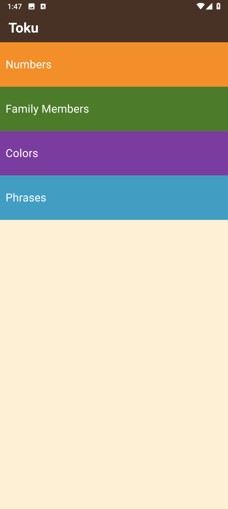
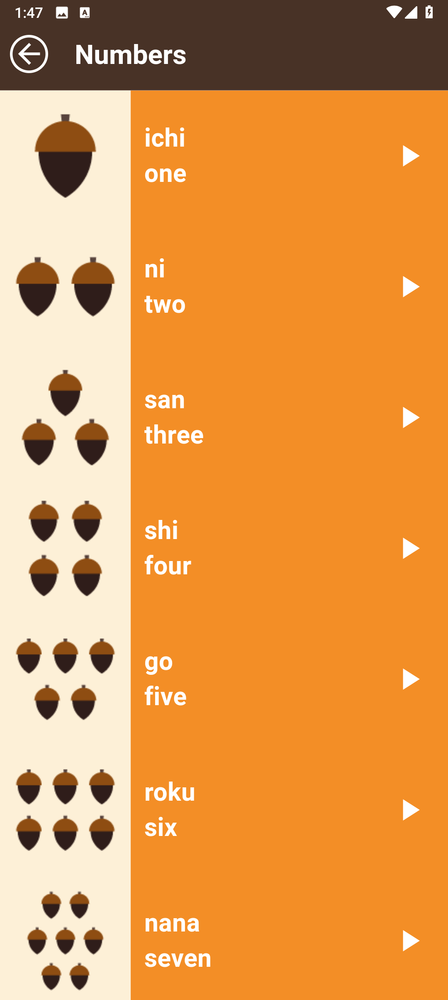
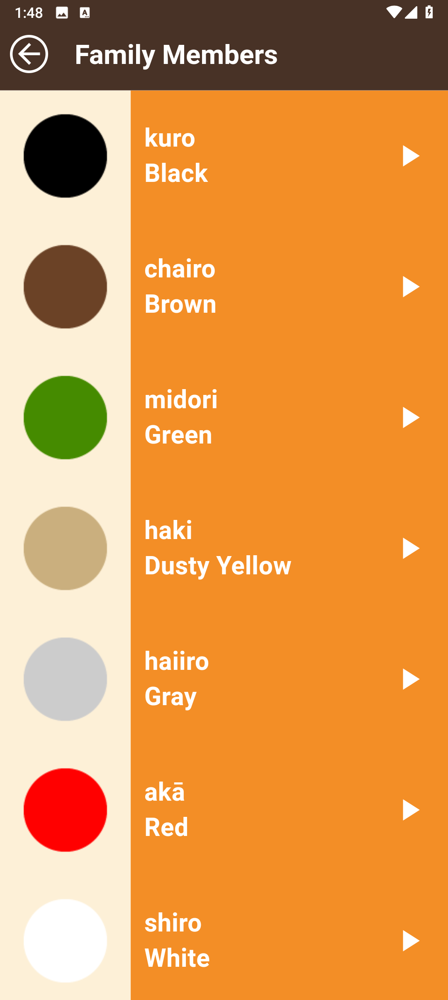
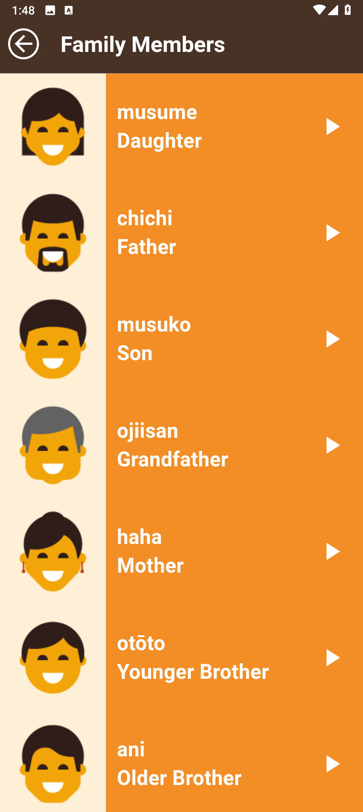
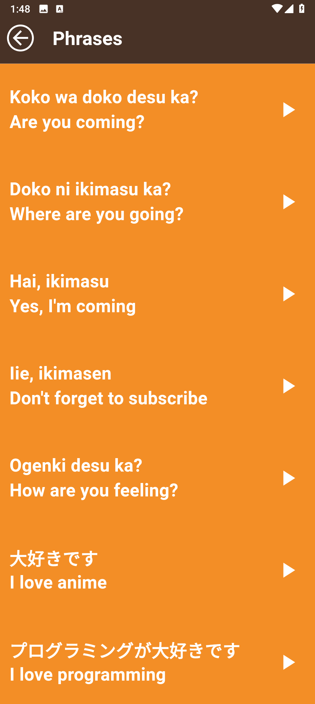

# Learn Japanese Language App

## Overview
**Learn Japanese Language App** is a Flutter application designed to help users begin learning basic Japanese vocabulary through categories like numbers, family members, colors, and useful phrases. Each word or phrase is paired with an image and audio pronunciation to enhance retention and understanding.

## Screenshots

<p align="center">
  
  
  
  
  
</p>

## Features
- Categorized Japanese words with images and sounds
- Tap to play native pronunciation for each item
- Clean and colorful user interface
- Supports responsive layout using `flutter_screenutil`

## Getting Started

### Requirements
- Flutter SDK >= 3.8.1  
- Dart SDK  
- Compatible with Android, iOS, and other supported platforms

### Installation

1. **Clone the repository**
   ```bash
   git clone https://github.com/OmarGamalDev/learn_japanese_language_app.git
   cd learn_japanese_language_app
    ```

2. **Install dependencies**

   ```bash
   flutter pub get
   ```

3. **Run the app**

   ```bash
   flutter run
   ```

## Packages Used

* [`audioplayers`](https://pub.dev/packages/audioplayers): For playing sound files
* [`flutter_screenutil`](https://pub.dev/packages/flutter_screenutil): For responsive sizing
* [`cupertino_icons`](https://pub.dev/packages/cupertino_icons): iOS-style icons

## Usage

Navigate through the categories from the home screen. Tap any item to hear its pronunciation in Japanese. Visual cues and colors are used to help differentiate categories and aid memorization.

## Notes

This app is intended for learning purposes. It demonstrates basic Flutter UI design, audio integration, and asset management for educational apps.

